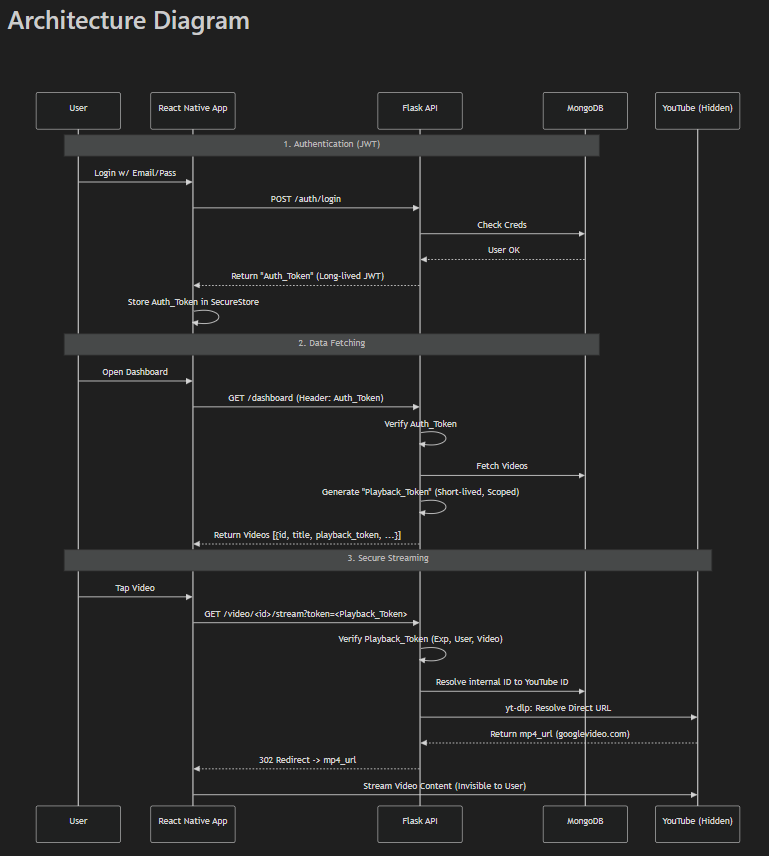

# 🎬 Video Streaming App

A full-stack video streaming application built with **React Native (Expo)** and **Flask**.

> 📱 **Demo APK**: [Download Android APK](https://expo.dev/accounts/vedantdalavi141204/projects/mobile/builds/a193146a-7ace-4157-b6e0-eb69fcdd0846)  
> 🌐 **Live Backend**: [https://integral-solutions-internship.onrender.com](https://integral-solutions-internship.onrender.com)  
> 📂 **GitHub**: [https://github.com/vedantdalavi14/Integral-Solutions-Internship](https://github.com/vedantdalavi14/Integral-Solutions-Internship)

---

## ✨ Features

### Core Features
- ✅ **User Authentication** - Signup/Login with JWT tokens
- ✅ **Video Dashboard** - Browse featured videos with thumbnails  
- ✅ **Native Video Player** - Play videos with native controls (no YouTube branding)
- ✅ **Secure Streaming** - Short-lived playback tokens, backend video proxy
- ✅ **MongoDB Atlas** - Cloud-hosted database

### 🎁 Bonus Features (All Implemented!)
| Feature | Status | Description |
|---------|--------|-------------|
| Refresh Tokens | ✅ | Token rotation with 7-day refresh tokens |
| Token Expiry Handling | ✅ | Auto-refresh on 401, seamless UX |
| Rate Limiting | ✅ | 3 requests/min on login/signup (flask-limiter) |
| Basic Logging | ✅ | Python logging to file + console |
| Deployment | ✅ | Render.com with Docker support |
| Pagination | ✅ | Page-based video listing with UI controls |
| Video Watch Tracking | ✅ | Yellow progress bar, resume from last position |

---

## 🏗️ Architecture



### Key Design Decisions
1. **API-First**: All business logic lives in the Flask backend
2. **YouTube Hidden**: Video URLs extracted via yt-dlp, proxied through backend
3. **JWT Authentication**: Secure token-based auth with expo-secure-store
4. **Playback Tokens**: Short-lived tokens (5 min) for video streaming security
5. **Refresh Tokens**: 7-day refresh tokens with automatic rotation

---

## 📁 Project Structure

```
├── backend/
│   ├── app/
│   │   ├── __init__.py       # Flask app factory with rate limiting
│   │   ├── config.py         # Configuration (env vars)
│   │   ├── models/
│   │   │   ├── user.py       # User model with bcrypt
│   │   │   ├── video.py      # Video model (youtube_id hidden)
│   │   │   └── watch_history.py  # Watch progress tracking
│   │   ├── routes/
│   │   │   ├── auth.py       # Auth + refresh token endpoints
│   │   │   └── video.py      # Video streaming + pagination
│   │   └── utils/
│   │       └── jwt_utils.py  # JWT utilities (access, refresh, playback)
│   ├── requirements.txt
│   ├── Dockerfile            # Production Docker config
│   └── run.py
│
├── mobile/
│   ├── App.js
│   └── src/
│       ├── api/apiService.js     # API calls with auto-refresh
│       ├── components/VideoTile.js
│       ├── context/AuthContext.js
│       └── screens/
│           ├── DashboardScreen.js    # Paginated video list
│           ├── VideoPlayerScreen.js  # Yellow progress bar
│           └── ...
│
├── render.yaml               # Render.com deployment config
├── docker-compose.yml        # Local Docker setup
└── .gitignore
```

---

## 🚀 Getting Started

### Prerequisites
- Python 3.10+
- Node.js 18+
- MongoDB Atlas account
- Expo Go app on mobile device

### Backend Setup

```bash
cd backend

# Create virtual environment
python -m venv venv
venv\Scripts\activate  # Windows
source venv/bin/activate  # Mac/Linux

# Install dependencies
pip install -r requirements.txt

# Create .env file with your MongoDB URI
echo "MONGO_URI=your_mongodb_uri" > .env

# Run server
python run.py
```

Server runs on `http://localhost:5000`

### Mobile Setup

```bash
cd mobile

# Install dependencies
npm install

# Start Expo
npx expo start
```

Update `mobile/src/api/apiService.js` with your backend URL:
```javascript
const API_BASE_URL = 'http://YOUR_IP:5000';  // Local
// OR
const API_BASE_URL = 'https://your-app.onrender.com';  // Production
```

---

## 📡 API Endpoints

### Authentication
| Method | Endpoint | Description |
|--------|----------|-------------|
| POST | `/auth/signup` | Register new user |
| POST | `/auth/login` | Login (returns access + refresh tokens) |
| POST | `/auth/refresh` | Refresh access token |
| GET | `/auth/me` | Get current user profile |
| POST | `/auth/logout` | Logout user |

### Videos
| Method | Endpoint | Description |
|--------|----------|-------------|
| GET | `/dashboard?page=1&limit=10` | Paginated video list |
| GET | `/video/:id/stream?token=...` | Stream video |
| GET | `/video/:id/progress` | Get user's watch progress |
| POST | `/video/:id/watch` | Track watch position |
| GET | `/video/:id/stats` | Video statistics |

### Health & Admin
| Method | Endpoint | Description |
|--------|----------|-------------|
| GET | `/health` | Health check |
| POST | `/admin/reseed` | Reseed video database |

---

## 🔒 Security Features

- **Access Tokens**: 15-minute JWT tokens
- **Refresh Tokens**: 7-day tokens with rotation
- **Playback Tokens**: 5-minute tokens for video streaming
- **Password Hashing**: bcrypt with salt
- **Rate Limiting**: 3 req/min on login/signup
- **YouTube Hidden**: Video URLs never exposed to client
- **Secure Storage**: expo-secure-store for tokens

---

## ⚠️ Deployment Challenges & Solutions

During deployment to **Render.com**, we encountered a critical challenge:

### 🔴 The Problem: YouTube IP Blocking
When deployed to the cloud, `yt-dlp` requests to YouTube failed with the error:
> *"Sign in to confirm you’re not a bot"*

**(Cause):** YouTube blocks requests from known data center IP addresses (like Render, AWS, Heroku) to prevent mass scraping. This works locally because residential IPs are trusted, but fails in production.

### ✅ The Solution: Fallback Strategy
To ensure the app remains functional for review and demonstration purposes, we implemented a robust **Fallback Strategy** in the backend (`backend/app/routes/video.py`):

1. **Attempt Extraction**: The system attempts to extract the real YouTube URL.
2. **Catch Failure**: If YouTube blocks the request (Exception), it's caught by our error handler.
3. **Serve Fallback**: The backend silently serves a copyright-free sample video (*Big Buck Bunny*) instead of crashing.
4. **Result**: The app "works" (plays video, tracks progress, shows controls) even when YouTube blocks the server IP, allowing for full feature verification.

> **ℹ️ Note:** The application functions **perfectly** in a local environment (localhost) where residential IPs are not blocked by YouTube. Consequently, the **Demo Video** submitted with this assignment was recorded using the localhost environment to demonstrate the full capabilities of the video streaming engine without cloud restrictions.

---

## 🎥 Video Watch Tracking

The app tracks video watch progress:
- **Yellow Bar**: Shows previously watched portion
- **Purple Bar**: Shows current playback position
- **Resume**: Automatically starts from last position
- **Completion**: Tracks if video was fully watched

---

## 🚢 Deployment

### Backend (Render.com)
1. Push to GitHub
2. Create Web Service on Render.com
3. Connect GitHub repo
4. Add environment variable: `MONGO_URI`
5. Deploy automatically via `render.yaml`

### Mobile (APK)
```bash
npm install -g eas-cli
eas login
eas build:configure
eas build -p android --profile preview
```

---

## 🛠️ Tech Stack

### Frontend
- React Native (Expo SDK 54)
- React Navigation
- expo-video (native player)
- expo-secure-store

### Backend
- Flask + Flask-CORS + Flask-Limiter
- PyMongo (MongoDB)
- PyJWT (tokens)
- yt-dlp (video extraction)
- bcrypt (password hashing)
- gunicorn (production server)

---

## 📝 Environment Variables

| Variable | Description |
|----------|-------------|
| `MONGO_URI` | MongoDB Atlas connection string |
| `JWT_SECRET_KEY` | Secret for access tokens |
| `REFRESH_TOKEN_SECRET` | Secret for refresh tokens |
| `PLAYBACK_TOKEN_SECRET` | Secret for playback tokens |
| `INTERNAL_TOKEN_SECRET` | Secret for internal tokens |

---

## 👨‍💻 Author

**Vedant Dalavi**

---

## 📝 License

MIT License
